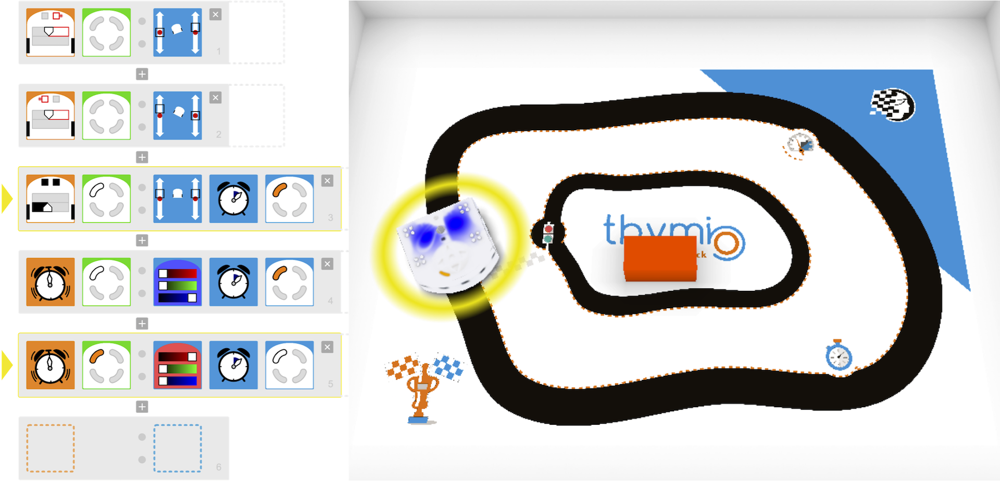

Programmer des robots Thymio
----------------------------

Atelier ASTEP 2017-18

*Pierre Nagorny est doctorant à l'Université Grenoble Alpes. Il
travaille sur le réglage automatique des machines industrielles. Il a pu
intervenir dans le cadre de sa formation d'enseignant à l'école primaire
par le biais de la convention [ASTEP, La main à la
pâte](https://www.fondation-lamap.org/fr/astep).*  

Je suis intervenu pendant 6 semaines les mardi et mercredi matin dans deux classes de CM1/CM2 et CM2 de l'[école Quai Jules Philippe](http://www.ac-grenoble.fr/ecole/74/quai-jules-philippe.annecy/) à Annecy sous la supervision des professeures des écoles Madame Muller et Madame Paternostre. Je me permets de les remercier pour leur accueil et leur expertise précieuse. Je remercie Madame Prévot Directrice de l'école, la ville d'Annecy et Madame Christine Lavigne-Deville, pour leur aide et la mise à notre disposition la salle informatique.  
J'enseigne au quotidien à des étudiants Bac +3 (moyenne d'âge : 21 ans) à l'école d'ingénieurs Polytech Annecy-Chambéry. Bien qu'ayant une décennie d'écart, les élèves de CM1/CM2 sont réceptifs, intéressés et surtout curieux. Côtoyer cet autre public fut très enrichissant.  

Les robots ont été emprunté au [CREST de Grenoble](http://iufm-crest.ujf-grenoble.fr/).

Nous nous sommes appuyés sur des documents éprouvés de l'INRIA : [IniRobot](https://dm1r.inria.fr/) et sur le [Challenge Pack d'Aseba](https://www.thymio.org/fr:thymiochallengepack).

L'ensemble des slides de supports à mon intervention est [disponible ici](https://github.com/a1rb4Ck/ASTEP_Thymio_2018/slides).

### La séance d'introduction : des questions éthiques et sociétales

Cette première séance avait pour double objectif de présenter la programmation et de découvrir le robot Thymio.  

En première partie, une présentation sur le tableau interactif sous forme de questions posées aux élèves a permis de définir ce qu'est la programmation et ce qu'est un robot. Cette partie fut une des plus étonnantes pour moi puisque nous avons rapidement soulevé des problématiques tel que l'intelligence artificielle et le rôle des robots dans notre société. Il serait très intéressant d'organiser un débat à ce sujet pour approfondir.  

La seconde partie a permis aux élèves de manipuler et découvrir le robot en petits groupes de 3-4 élèves. Le robot possède des programmes simples accessibles par des touches tactiles ce qui a permis de le faire fonctionner sans programmation.  

Qu'est-ce qu'un robot ?  

  

### Le plan des séances

**Séance 1 : introduction**  
- Introduction de l'intervenant Pierre Nagorny. Ma recherche.  
- Avez-vous déjà vu un robot ? Où ? Que faisait-il ?  
- Présentation vidéo de mon utilisation industrielle de robots (et d'autres robots)  
- Déplacement en salle informatique pour manipuler les robots  
- Mission 1 à 4 : C'est quoi ce truc ?, Des couleurs et des comportements, Si \... alors ..., Et si on programmait ?  

**Séance 2**  
- Mission 5 à 9 : A l'intérieur du robot, capteurs et détection, le robot et l'Homme.  

**Séance 3**  
- Mission 10 à 14 : Parcours d\'obstacles  
- Présentation de la suite des missions : tirer une carte mission et la réaliser en équipe  

**Séance 4**  
Réaliser au moins une mission (carte) de niveau Facile.  

**Séance 5**  
Réaliser au moins une mission (carte) de niveau Avancé.  

**Séance 6**  
Devenir un expert de la programmation de Thymio : les mémoires et les timers. Conclusion de la séquence.  

### Blockly vs Thymio VPL
Nous avons choisi de réaliser les toutes premières séances sur le logiciel de programmation **Blockly**. Celui-ci représente mieux le formalisme des langages de programmation indentées que les programmeurs doivent maîtriser et que certains élèves connaissent déjà. Par la suite, le logiciel **Thymio VPL**, plus visuel, permet de réaliser des programmes aux
fonctionnalités plus avancées (mémoires, automate à états finis, timers). Néanmoins, la notion de mémoire devient alors complètement détachée de la notion de variables mathématiques. L'évaluation des deux logiciels m'a permis de constater une facilité de manipulation de VPL légèrement supérieure à Blockly. Enfin, travailler sur les timers et les mémoires n'est pas réalisable à ce niveau avec Blockly.  

### Résultats : des robots programmés !

A l'issu des séances, les élèves ont réalisé toutes les missions d'IniRobot et au moins quatre missions « avancées » du Challenge Pack.  
La réussite de ces missions est à chaque fois concrétisée par les interactions du robot réel. Les élèves ont travaillé en petit groupe tout au long des séances en s'entre-aidant afin de résoudre les problèmes.  
Par la problématique des missions, les élèves ont appréhendé la démarche d'investigation pour résoudre un problème : réflexion afin de proposer une solution et validation expérimentale.  
La dernière séance nous a permis de présenter la notion de mémoire et de variable ainsi que la notion de minuteurs. Nous avons fait le lien avec les notions de vitesse, distance et temps. Nous n'avions pas prévu d'aborder ces notions avancées dans le plan initial, mais comme les élèves ont rapidement maitrisé les notions de bases, nous avons pu aller plus loin.

De mon côté, en tant qu'apprenti enseignant, j'ai appris à côtoyer un public différent avec l'aide d'enseignantes expertes. L'école primaire propose un enseignement sur mesure, adapté à chaque enfant. Cette expérience m'a appris de nouvelles méthodes d'enseignement, notamment le fait d'arriver à s'adapter à chaque élève.  
Je n'avais en mémoire, jusqu'à présent que le point de vue d'un écolier et cette expérience m'en a apporté un autre sur l'école qui est, je pense, indispensable à tout enseignant, voire à tout parent d'élève. L'école primaire est un endroit clé de la scolarité et je suis heureux d'avoir rencontré des enseignantes passionnées.  

  
Thymio est une ambulance : Simulation d'un programme réalisé par un groupe d'élèves, suivi de ligne et changement de couleur temporisé.    

### Faisabilité technique : Problème solving

Une première séance de mise en place est nécessaire lors de l'utilisation d'un nouvel outil et qu'il faut que l'encadrant soit très réactif lors de celle-ci. Une fois
le matériel éprouvé et la plupart des subtilités techniques levées, nous
avons travaillé dans des conditions sereines.\
Cette barrière de la première séance est une difficulté pour tous les
enseignants. C'est la principale limite à l'utilisation de nouveaux
outils, dont les outils informatiques, qui évoluent régulièrement. C'est
pourquoi le dispositif ASTEP est une réelle opportunité pour tester et
mettre en place de nouveaux outils pédagogiques.  

### La programmation de Thymio en images

IMAGES  

### Remerciements

Merci aux professeures des écoles Madame Muller et Madame Paternostre ainsi qu'à Madame Prévot Directrice de l'école Quai Jules Philippe pour leur accueil. Merci à Madame Christine Lavigne-Deville pour son assistance technique. Merci au CREST de Grenoble pour le prêt des valises de robots Thymio.  

Merci aux élèves de l'école Quai Jules Philippe pour leurs questions pertinentes et tous les échanges. Ce sera un réel plaisir de travailler ensemble dans quelques années. Bonne programmation.  

Source: [blog ASTEP Université Grenoble Alpes](https://doctorat.univ-grenoble-alpes.fr/fr/pendant-la-these/la-formation-durant-la-these/parcours-labels/ateliers-projets-du-label-res/ateliers-astep-/programmer-des-robots-thymio-754129.htm?RH=GUCEDFR_PROJ)
